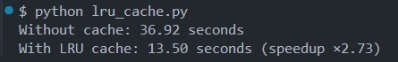

# LRU Cache for Range Sum Queries Optimization

This project demonstrates how an **LRU (Least Recently Used) cache** can significantly speed up repeated "hot" queries for sum ranges in a large array of integers.

## Description

We have an array of positive integers and need to process two types of queries:

- `Range(L, R)`: Compute the sum of elements from index `L` to `R` inclusive.
- `Update(index, value)`: Update the element at `index` with a new `value`.

The array can be very large (up to 100,000 elements), and the number of queries is also large (up to 50,000).

To speed up processing, we implement an LRU cache that stores results of recent `Range` sum queries. When an element is updated, the cache invalidates all stored sums that include that element's index.

## Features

- Custom implementation of an **LRU cache** using `OrderedDict` for efficient caching of range sums.
- Selective invalidation of cache entries when array updates affect cached ranges.
- Simulation of realistic query workloads including "hot" frequently accessed ranges.
- Performance comparison between uncached and cached query processing.

## How It Works

1. **Without cache** — each `Range` query computes the sum by iterating over the array slice.
2. **With cache** — results of recent `Range` queries are cached. Cache hit returns the stored sum immediately.
3. On `Update`, only cached ranges covering the updated index are invalidated, preserving other cached sums.

## Usage

Run the test script:

```bash
python lru_range_sum.py
```
## Result



---


